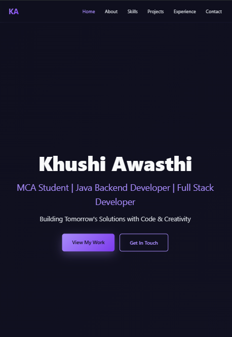

# 🌐 Khushi Awasthi - Developer Portfolio

Welcome to my personal portfolio website! This portfolio showcases my projects, technical skills, certifications, education, and experience as an aspiring **Software Developer** and **Full Stack Developer**.

🔗 **Live Website:** https://khushi-portfolio-five-rho.vercel.app

---

## 📖 About

Hi, I'm **Khushi Awasthi**, an MCA student at Pranveer Singh Institute of Technology (PSIT), Kanpur.

I'm passionate about building scalable web applications and solving real-world problems using Java, React, Node.js, SQL, and modern web technologies.

This portfolio serves as a central place to showcase my work, technical skills, certifications, and achievements.

---

## ✨ Features

- 🎨 Modern and responsive UI
- 🌙 Dark theme design
- 📱 Mobile-friendly layout
- 🚀 Smooth scrolling and animations
- 💼 Project showcase
- 🛠 Technical skills section
- 📜 Certifications & achievements
- 🎓 Education timeline
- 📬 Contact information with social links

---

## 🛠 Tech Stack

### Frontend
- HTML5
- CSS3
- JavaScript (ES6)

### Deployment
- Vercel

### Tools
- Git
- GitHub
- VS Code

---

## 📂 Portfolio Sections

- 🏠 Home
- 👩‍💻 About Me
- 🛠 Technical Skills
- 🚀 Featured Projects
- 💼 Experience
- 🎓 Education
- 📜 Certifications
- 📞 Contact

---

## 🚀 Featured Projects

### 🎯 Gamified LifeCraftAI
AI-powered full-stack platform for resume analysis, skill-gap detection, personalized learning recommendations, and gamified career guidance.

**Tech Stack**
- React.js
- Node.js
- MongoDB
- Firebase

---

### 💧 Smart Reservoir Management System
Machine Learning project that predicts water levels using LSTM models and helps optimize water release.

**Tech Stack**
- Python
- Keras
- Tableau

---

### ☕ Java Memory Analyzer
Java application demonstrating JVM memory management, Heap, Stack, Garbage Collection, and memory leak simulation.

---

### 🏥 Hospital Appointment System
Database-driven hospital management system with patient records and appointment scheduling.

---

## 📸 Preview




---

## 💻 Run Locally

Clone the repository

```bash
git clone https://github.com/khushi-awasthi/<repository-name>.git
```

Open the project folder

```bash
cd <repository-name>
```

Open

```text
index.html
```

using your preferred browser.

---

## 📬 Connect With Me

📧 Email  
**khushiawasthi8834@gmail.com**

💼 LinkedIn  
https://www.linkedin.com/in/khushiawasthi/

💻 GitHub  
https://github.com/khushi-awasthi

🧩 LeetCode  
https://leetcode.com/u/Khushi_Awasthi1/

---

## ⭐ If you like this project

If you found this portfolio inspiring or useful, consider giving the repository a ⭐.

It motivates me to continue building and improving my projects.

---

## 📄 License

This project is open source and available under the MIT License.
